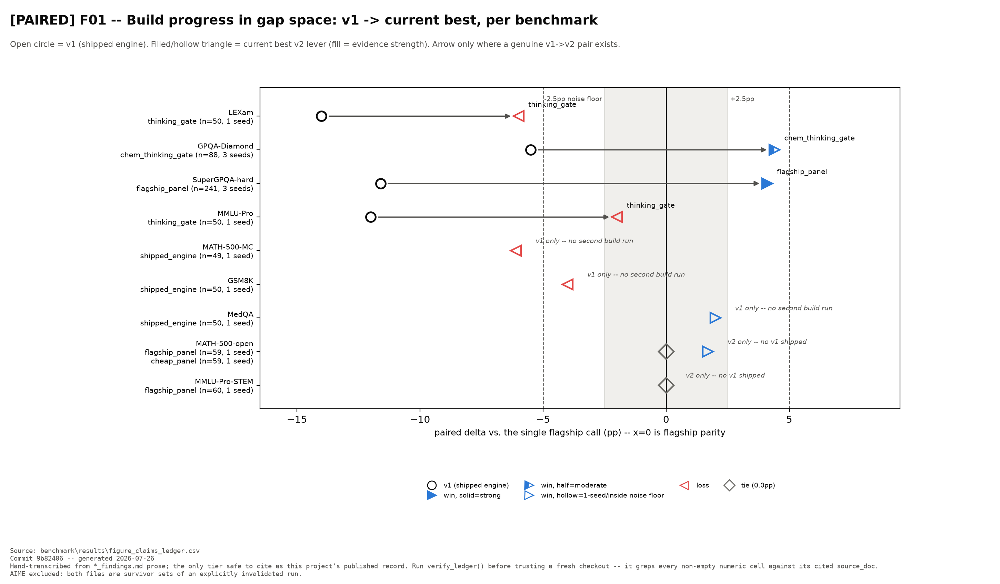

# QuorumQA -- a Qwen Cloud Agent Society

*Global AI Hackathon Series with Qwen Cloud -- Track 3: Agent Society*

Three cheap Qwen Solvers vote independently on a hard, "Google-proof"
science question. If they agree, done. If they split, a Skeptic, a
tool-using Verifier (via a real MCP server), and a Judge escalate and
resolve the disagreement -- and the Judge's ruling, including any unresolved
dissent, is recorded verbatim, never papered over into false consensus.

**Measured on the full 90-question GPQA-Diamond set (complete run, no
dropped questions):** three cheap solvers, plus a flagship Judge called only
on the 37.8% of questions where they split, reach **78.9%** — against 58.9%
for those same cheap models run as a plain self-consistency@5 ensemble, and
84.4% for that flagship answering every question alone. So it closes ~78% of
the gap to the flagship at **11% lower cost in dollars** ($0.0213 vs
$0.0240/question, pre-Token-Plan pricing). **In tokens — the unit that now
bills — the same engine costs 8,690 vs 2,792 per item, 3.1× more**, and on
identical items across 3 fresh seeds the full stack is net +1, p=0.50 against
one `qwen3.7-max` call (`docs/FINDINGS-2026-08.md`).
The saving comes from *routing* the expensive model to the questions that
need it, not from avoiding it: the Judge and the baseline are the same
`qwen3.7-max`. Every other role (3 solvers, Skeptic, Verifier) runs on
`qwen3.6-flash`. The Judge overturned the solver panel's plurality 14 times
and was correct in 11 (78.6%).

**Live site:** [magiachiral.com](https://magiachiral.com) replays real
recorded deliberations from this run, scoreboard and all 33 case transcripts
included.

See [`docs/architecture.md`](docs/architecture.md) for the design,
[`benchmark/results/summary.md`](benchmark/results/summary.md) for the full
scorecard, and [`docs/submission.md`](docs/submission.md) for the hackathon
submission text. Re-run everything yourself with the two commands in
"Quickstart" below -- the dataset answer key is public, nothing is
self-graded.

## Quickstart

```bash
python3.11 -m venv .venv
source .venv/bin/activate   # or .venv\Scripts\activate on Windows
pip install -e . -r requirements.txt
cp .env.example .env        # fill in DASHSCOPE_API_KEY at minimum
```

Run the offline test suite (no API key, no cost -- validates the
orchestration logic and the MCP tool server):

```bash
pytest tests/ -v
```

Run the live dashboard:

```bash
streamlit run dashboard/app.py
```

Run the full benchmark (needs a real `DASHSCOPE_API_KEY`):

```bash
python -m benchmark.run_benchmark --n 90 --self-consistency
python -m benchmark.score benchmark/results/run.jsonl
```

## Project layout

```
src/quorumqa/
  config.py            role -> Qwen Cloud model tier mapping + pricing
  qwen_client.py        thin OpenAI-compatible DashScope client wrapper
  schemas.py             pydantic models for every role's output
  engine/                solver, skeptic, verifier, judge, orchestrator
  tools/                 the Verifier's MCP server + client (real MCP, not a shim)
benchmark/                GPQA-Diamond loader, benchmark runner, scorer
dashboard/                Streamlit UI: live question + benchmark scoreboard
deploy/                   Alibaba Cloud OSS client (proof of deployment) + ECS notes
docs/                     architecture diagram and design notes
```

## Research and findings

**→ [`docs/FINDINGS-2026-08.md`](docs/FINDINGS-2026-08.md) — the current,
complete account, and the one to read first.**
**→ [`docs/FINDINGS.md`](docs/FINDINGS.md) is the index to everything measured.**
**→ [`docs/figures/`](docs/figures/README.md) is the same story in thirteen figures.**

> **August 2026 update — read this before the numbers above.** We finally
> measured the whole engine against the obvious alternative of *calling the
> flagship once*, on identical items. On GPQA-Diamond it is **net +1,
> p = 0.50, at 4.7× the tokens** — a single flagship call dominates the
> architecture there. On SuperGPQA-hard, where the base model is 10 points
> weaker, orchestration **does** win (+7, p = 0.0327, 3 seeds) — but a compute-matched
> control attributes that gain to **self-consistency sampling, not
> deliberation**. Ten separate mechanisms for detecting a confident-but-wrong
> panel were tested; all ten are null.
>
> One number in this README needs its unit stated: the *"11% lower cost"* below
> is measured in **dollars** under the pre-Token-Plan pricing. Under the Token
> Plan the billing unit is tokens, and in tokens the same engine costs
> **8,690 vs 2,792 per item — 3.1× more**. Both are correct; they are different
> currencies, and the token one is the one that now binds.



*Every benchmark's distance from a single `qwen3.7-max` call. x=0 is flagship
parity; open circle = the initial build, filled triangle = current best. The gap
closed on all four benchmarks where we built twice, and crossed zero on two.
Arrows appear only where a genuine second build exists — the other five
benchmarks ran one build and say so.*

The short version, **narrowed 2026-08**: *extra sampled compute* pays where the
base model has headroom; *deliberation on top of that compute* has not been
shown to add anything (against a compute-matched control the tribunal is net
+1, p=0.50). Decorrelated disagreement plus a firing escalation gate is
necessary for the cascade to act at all, but it is not sufficient for a win. The
cheap-to-flagship gap (the unanimous-wrong rate) **bounds** whether a win is
arithmetically possible — a lever cannot move more accuracy than there is
unanimous-wrong to recover.

**⚠ Corrected 2026-08-03: this paragraph used to say the gap "predicts" the
outcome. It does not, and we tested it rather than leaving the word standing.**
Across the 5 benchmarks with both numbers measured, Pearson **r = −0.216
(p = 0.73)** and Spearman **ρ = +0.100 (p = 0.87)** — the two correlations do
not even agree on the *sign*. The decisive pair:

| benchmark | unanimous-wrong | best lever | evidence |
|---|---:|---:|---|
| LEXam | 22.0% | **−6.0 pp** | 1 seed, screen |
| SuperGPQA-hard | 23.0% | **+4.1 pp** | 3 seeds, validated |

One point of headroom apart, opposite directions. Levers convert between
**−27% and +50%** of the available headroom, a range that spans zero. So the
rate is a **ceiling, not a forecast**: it tells you whether a win is possible,
never whether one will happen or which way it will go. Only 1 of those 5 points
is validated at 3 seeds, which is a further reason not to fit a rule to them.
Reproduce with `python -m benchmark.analyze_headroom_rule`.

Where LEXam loses despite its large gap, the missing ingredient is *knowledge*,
not decorrelation. See [`docs/figures/`](docs/figures/) — the "large gap, lever
still lost" quadrant. Note also that benchmark difficulty, baseline height and
the subject label are all *equally* unpredictive here; medicine and hard science
are both knowledge-and-reasoning multiple choice and sit at opposite ends of the
table.

One result clears the 3-seed bar against a single `qwen3.7-max` call:
`flagship_panel` on SuperGPQA-hard, **82.2% vs 79.2%, pooled net +7,
p=0.0327, n=236 paired items** (seeds 7/42/123) — at **~3.4× the measured
tokens** (9,969 vs 2,969/item).

*Two valid seed-42 flagship baselines exist and differ by 2.4pp, so this test
has two defensible figures: net +7 / p=0.0327 with the standalone baseline
(quoted above, the **more conservative**) and net +10 / p=0.0032 with the
pilot-embedded one. The verdict holds either way; see the addendum in
[`gpqa_paired_cost_frontier.md`](benchmark/results/gpqa_paired_cost_frontier.md).*

**⚠ Then we ran the compute-matched control, and it did not survive.** On
2026-07-30 we ran the arm our own roadmap had always required: 3× `qwen3.7-max`
single calls, majority vote, no tribunal, same items and seeds. Measuring each
leg directly:

- 3× flagship majority **vs 1× flagship**: net **+9**, p=**0.025** — clears.
- `flagship_panel` **vs 3× majority**: net **+2**, p=**0.34** — does not clear.

So the gain is a **compute effect, not a deliberation effect**: three samples of
the flagship beat one sample of it, and routing those samples through a
skeptic/verifier/judge tribunal instead of a plain majority adds nothing
measurable. Self-MoA (ICML 2025) predicted this; it is why the control was
mandated. We are reporting it because we ran it, not despite having run it.

The other headline numbers are also weaker than this README used to imply, and
the corrections are stated at the point of use in
[`docs/FINDINGS.md`](docs/FINDINGS.md):

- **Chemistry**: the missing matched baselines (seeds 217, 471) landed
  2026-07-29, completing a real 3-seed paired result — pooled net **+12,
  p=0.0059, clears the bar**. Not three uniform wins, though: seed 217 alone
  is +9 (p=0.002), seed 314 is +4 (noise), and **seed 471 is −1**. The 90.9%
  candidate-arm mean is unchanged; only the delta against a matched baseline
  was previously incomplete.
- **Retrieval +3.5** is measured against the **cheap-panel control**, not
  against a flagship call. Against a flagship call `rag_presolve` *loses* on
  every seed where the comparison is possible (−7.0 / −2.4 / −4.7).
- **GPQA-Diamond** matches-or-beats, marginal and inside noise.

The shipped submission config is 78.9% — *below* the flagship's 84.4%, at ~11%
lower cost **in dollars**; that was always a cost claim, and in tokens it is
3.1× *more* expensive.

The largest artifact is the negative results:
**[`docs/negative-results.md`](docs/negative-results.md)** — 23 measured nulls
each with its mechanism, 6 methodological errors we caught in our own work, and
4 adjudicated contradictions between our own documents.

Prior work establishes multi-agent debate, aggregation, routing, judging, and
tool-assisted verification — this project builds on it rather than predating it.
What the null ledger contributes is a **source-traced, Qwen-specific record of
how one disagreement-triggered cascade behaves across multiple benchmarks**,
including where it fails, wastes escalation, or cannot observe unanimous errors:
one stack, one harness, one cost model, every claim traced to a committed
artifact. See [`docs/prior-art-and-positioning.md`](docs/prior-art-and-positioning.md)
for the component-level prior-art map and the claim boundaries.

## Deployment

The backend runs on Alibaba Cloud ECS and persists every deliberation
transcript to Alibaba Cloud OSS via [`deploy/oss_client.py`](deploy/oss_client.py)
-- see [`deploy/README.md`](deploy/README.md) for the full setup.

## License

MIT -- see [LICENSE](LICENSE).
