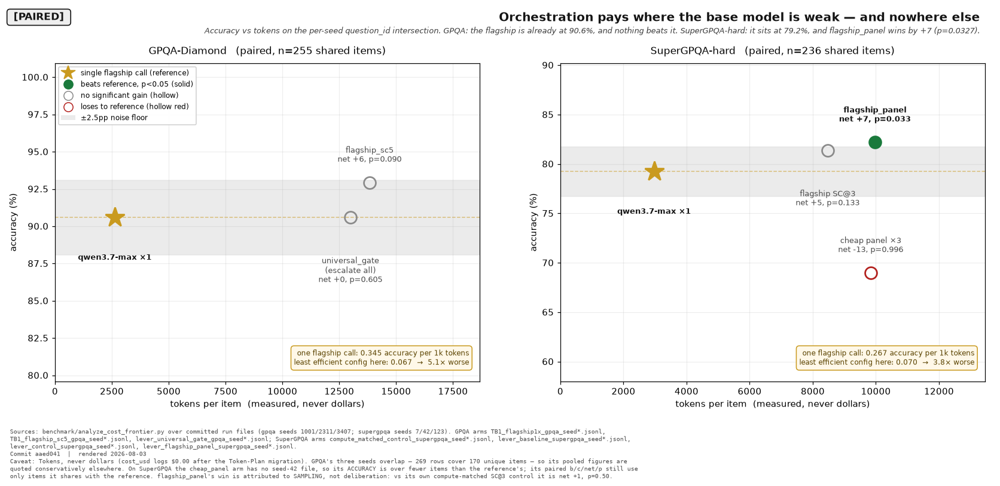
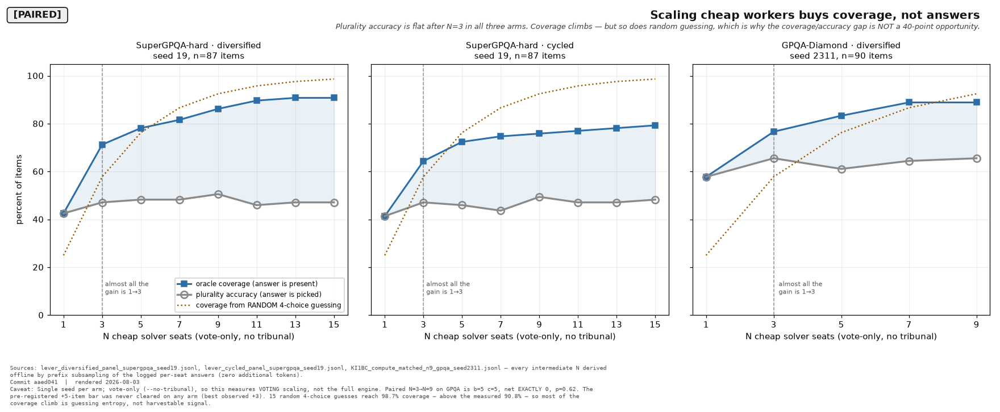
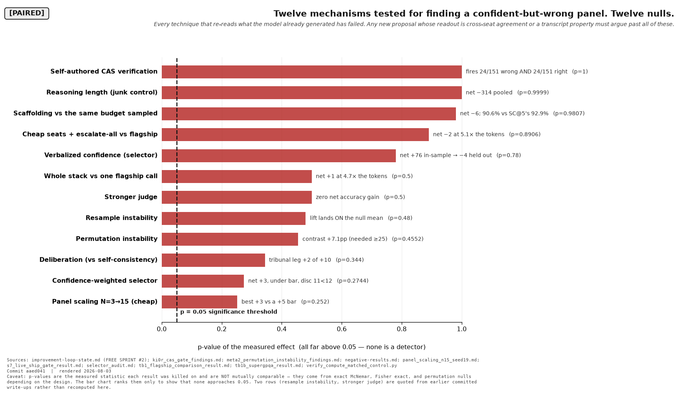
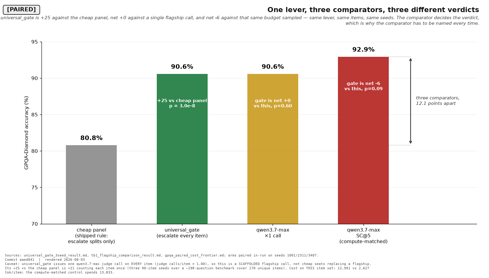

# What we actually found — QuorumQA, August 2026

A complete, honest account of what a multi-agent deliberation engine on Qwen
models does and does not buy. Most of it is negative. The negative results are
the contribution.

Every number below is **paired** — computed on the per-seed `question_id`
intersection of the arms being compared, never pooled across different item
samples — and traces to a committed result file and a pinned test. Where a
claim was retracted, the retraction is stated, not quietly dropped.

---

## The one-paragraph version

We built a society of cheap Qwen solvers that escalates disagreement to a
tool-using tribunal with a flagship judge. It works: escalating **every**
answer instead of only the split ones is worth **+25 items, zero losses,
p = 3 × 10⁻⁸** on GPQA-Diamond. But when we finally measured it against the
obvious alternative — *just call the flagship once* — the whole apparatus came
out **net +1, p = 0.50, at 4.7× the tokens** (net **+0**, p = 0.605 once arm C
joined the intersection — §4c). On GPQA-Diamond, QuorumQA is
dominated by a single flagship call. On SuperGPQA-hard, where the base model
is 10 points weaker, orchestration **does** win (+7, p = 0.0327, 3 seeds) — but a
compute-matched control shows the gain is **self-consistency sampling, not
deliberation**. Along the way, twelve separate mechanisms for detecting a
confident-but-wrong panel were tested. All twelve are null.

---

## 1. Orchestration pays where the base model is weak — and nowhere else



| GPQA-Diamond (n=255 paired, 3 arms) | accuracy | tokens/item | accuracy pts per 1k tokens |
|---|---:|---:|---:|
| **`qwen3.7-max` ×1** | 90.6% | **2,627** | **34.5** |
| `universal_gate` | 90.6% | 12,991 | 7.0 — net +0, p=0.605 |
| **`qwen3.7-max` SC@5** (compute-matched) | **92.9%** | 13,833 | 6.7 — the stack is net −6 vs this |
| shipped engine † | 80.8% | 8,690 | 9.3 — dominated |

† *The shipped engine has no run at these three seeds, so this row is carried over from the earlier 2-arm TB-1 frontier (n=265) and is **not** measured on the n=255 intersection the other three rows share. Kept because the comparison is still informative; marked because a table header that says n=255 should not silently contain a row that is not.*

*Recomputed 2026-08-03 on the 3-arm intersection. These figures replace an
earlier 2-arm table (89.4% / 2,792 / net +1 / n=265): adding arm C shrank S from
265 to 255, and a paired statistic is defined on its item set. Nothing was
re-measured. See `tb1_flagship_comparison_result.md` §5.2.*

| SuperGPQA-hard (3 seeds, n=236 paired) | accuracy | tokens/item | accuracy pts per 1k tokens |
|---|---:|---:|---:|
| `qwen3.7-max` ×1 | 79.2% | 2,969 | **26.7** |
| `flagship_sc3` | 81.4% | 8,470 | 9.6 — net +5, p=0.133 |
| **`flagship_panel`** | **82.2%** | 9,969 | 8.2 — net **+7, p=0.0327** ✅ |
| cheap panel ×3 | 69.0% | 9,836 | 7.0 — net −13, p=0.996 |

*(`cheap_panel` has no seed-42 run, so its accuracy is over n=158 while the
others are over n=236. Its paired statistic still uses only items it shares
with the reference.)*

The difference between the two tables is **headroom**. On GPQA the flagship is
already at **90.6%** and there is almost nothing left to win. On SuperGPQA-hard
it sits at 79.2%, and orchestration converts that gap into a real, significant
gain (3 seeds, +7, p=0.0327).

⚠ *But see §4c before treating headroom as a build rule: on SuperGPQA-hard the
**same** escalate-everything lever, built from cheap seats, LOSES (TB-1B, net
−2). Same benchmark, same headroom, opposite outcome — the difference is the
seat tier, not the headroom. And separately, the unanimous-wrong rate **bounds**
the achievable gain but does not predict it (r = −0.216, p = 0.73 across 5
benchmarks; see the README's corrected paragraph).*

**But the mechanism is not deliberation.** `flagship_panel` against its own
compute-matched self-consistency control is **net +1, p = 0.50**. Three
flagship samples beat one flagship call; adding a skeptic, a verifier and a
judge on top of those three samples adds nothing measurable. This
independently reproduces an earlier compute-matched finding on fresh seeds.

## 2. Scaling cheap workers buys coverage, not answers



| N cheap seats | SuperGPQA diversified | SuperGPQA cycled | GPQA diversified |
|---:|---:|---:|---:|
| 1 | 42.5% | 41.4% | 57.8% |
| 3 | 47.1% | 47.1% | 65.6% |
| 9 | 50.6% | 49.4% | 65.6% |
| 15 | 47.1% | 48.3% | — |

**Almost all the gain is 1→3.** After that it wanders inside noise: N=15 lands
*below* N=9 in one arm. The pre-registered +5-item bar was never cleared on any
arm (best observed +3). The scaling question proper — **N=3→N=9 on GPQA — is
b=5, c=5, net exactly 0, p = 0.62.**

Coverage climbs steadily (42%→91%), so the right answer keeps *appearing* more
often while plurality voting captures almost none of it. **We previously called
that a 40-point opportunity. That framing is retired:** fifteen uniformly random
4-choice guesses reach **98.7%** coverage, above the measured 90.8%. Most of
the climb is guessing entropy, not harvestable signal — which is why five
successive selectors have died against it.

## 3. Twelve mechanisms for catching a confident-but-wrong panel. Twelve nulls.



The engine's core weakness is that ~18% of its *unanimous* answers are wrong,
and unanimity is where it stops looking. Everything we tried to detect those:

| mechanism | measured | p |
|---|---|---:|
| Verbalized confidence (selector) | net +76 in-sample → **−4 held out**, sign-reversed on 2/3 seeds | 0.78 |
| Confidence-weighted selector | net +3, under bar | 0.2744 |
| Permutation instability | contrast +7.1pp (needed ≥25) | 0.4552 |
| Resample instability | lift lands **on** the permutation null mean | 0.48 |
| Self-authored CAS verification | fires **24/151 wrong AND 24/151 right** | **1.0000** |
| Reasoning length (junk control) | net −314 | 0.9999 |
| Stronger judge | 9/9 overturns correct, **zero net gain** | 0.50 |
| Cheap panel scaling N=3→15 | best +3 vs a +5 bar | 0.252 |
| Deliberation vs self-consistency | tribunal leg +2 of +10 | 0.344 |
| Whole stack vs one flagship call | net +0 at ~4.9× tokens (3-arm set, n=255) | 0.6047 |
| Cheap seats + escalate-all vs flagship | net −2 at 5.1× tokens (TB-1B, §4b) | 0.8906 |
| **Scaffolding vs the same budget sampled** | **net −6**; 90.6% vs SC@5’s 92.9% (TB-1 arm C, §4c) | **0.9807** |

The self-authored CAS result is the sharpest. We asked the model to write a
`sympy`-checkable equation for its own answer and ran a real offline
computation on it. The check fires on **exactly** as many right answers as
wrong ones — Fisher p = 1.0000, across 48 disjoint items. The arithmetic is
genuinely new information; **the premise is a re-read**, because the model
chooses which equation to write and writes one consistent with the answer it
already committed to. Verifying a self-authored premise verifies nothing.

**The pattern across all twelve: every mechanism that re-reads what the model
already generated has failed.** Any future proposal whose readout is cross-seat
agreement, or any property of an existing transcript, has to argue past all
twelve.

## 4. One lever, three comparators, three different verdicts



`universal_gate` — escalate *every* answer, not just the split ones — is a
genuine, well-controlled win over the shipped engine: **+25 items, zero losses,
p = 3.0 × 10⁻⁸**, three seeds, each clearing the bar independently, and it
survives a compute-matched control against nine cheap seats (+22, p = 0.00001).

It is *also* only **net +0, p = 0.605** against a single flagship call, and
**net −6, p = 0.981** against the same token budget spent on plain sampling
(§4c).

All three are true because the comparators are **12.1 points apart**. The
scaffolding buys back exactly the ground the cheap panel gives up, stops there,
and is then overtaken by simply sampling the strong model more.

**Which is why the comparator has to be named every time.** A result quoted as
"+25" and a result quoted as "−6" are the same lever on the same items at the
same seeds. Nothing about the engine changed between them; only what it was
measured against.

**What it is not:** `universal_gate` issues one `qwen3.7-max` judge call on
**every** item (measured: judge calls/item = 1.00). Nothing returns without a
flagship call. This is a *scaffolded flagship call*, not cheap seats replacing
a flagship, and the result should never be worded that way.

### 4b. TB-1B — the same lever on the benchmark where orchestration wins

**Measured 2026-08-03, seed 7, n=87 paired.** SuperGPQA-hard is the one surface
where anything has cleared the bar against a flagship call (`flagship_panel`,
+7, p=0.0327). If the reason were *headroom*, `universal_gate` — the same
escalate-everything architecture, built from cheap seats — should win there too.

**It loses.** Net **−2**, p = **0.89**, at **5.1×** the flagship's tokens
(15,255 vs 2,969). Both pre-registered kill clauses fired: the screen kill, so
the ~2.7M-token extension to seeds 42/123 was **not funded**; and the cost kill,
so it is reported as **dominated**.

| benchmark | `universal_gate` vs shipped rule | vs one flagship call |
|---|---:|---:|
| GPQA-Diamond | **+25** (p = 3×10⁻⁸) | +1 (p = 0.50) |
| SuperGPQA-hard | **+6** (p = 0.055) | **−2** (p = 0.89) |

Two benchmarks, one pattern: **the gain is always against the cheap panel and
never survives against the flagship.**

The mechanism is visible one level down. Of 87 items, 46 were unanimous and 18
unanimous-*wrong*; the lever recovered 8 and broke 2. But of those 8 recoveries,
**7 were items the flagship already had** and only **1** was one it missed. The
lever recovers almost exactly the items the flagship also finds easy, so a
headline "recovered 8" overstates the gain against the real comparator by 8×.

**This retires the headroom reading of the SuperGPQA win.** Same benchmark, same
headroom, same escalate-everything gate — opposite outcomes, and the only
difference is the seat tier. `flagship_panel` samples `qwen3.7-max` three times;
`universal_gate` samples `qwen3.6-flash`. The compute-matched control's
conclusion arrives a second time by a different route: **sampling the strong
model is what works; deliberation among weak ones is not.** See
[`tb1b_supergpqa_result.md`](../benchmark/results/tb1b_supergpqa_result.md).

### 4c. TB-1 arm C — the stack loses to its own budget spent on sampling

**Measured 2026-08-03. Seeds 1001/2311/3407, n=255 paired, |S|=85 every seed.**
This is the arm the TB-1 spec called "non-negotiable" and that a later note
**cancelled**; the cancellation was reversed and the reasons are recorded in
[`tb1_flagship_comparison_result.md`](../benchmark/results/tb1_flagship_comparison_result.md) §5.1.

| comparison | b | c | net | p | verdict |
|---|---:|---:|---:|---:|---|
| **A vs C** — stack vs the same budget sampled | 3 | 9 | **−6** | 0.981 | **ATTRIBUTION KILL FIRES** |
| A vs B — stack vs one flagship call | 7 | 7 | +0 | 0.605 | ties |
| C vs B — sampling vs one call *(context)* | 10 | 4 | +6 | 0.090 | directional |

Per seed A-vs-C reads **−1 / −2 / −3**. No seed carries the result.

**At essentially equal budget — 12,991 vs 13,833 tok/item, a 6% difference —
plain self-consistency scores 92.9% against the full scaffolded stack's 90.6%.**
So the finding is not the weak form "the tribunal fails to beat one call". It is
the strong form: **spend the tribunal's own budget on sampling instead and you
do measurably better.** The spec's pre-registered wording for this outcome, set
before the data existed, is *a compute effect, not an orchestration effect*.

The control is **admissible** — mean pairwise seat agreement 0.963/0.927/0.931
and split rates 8.1%/12.8%/12.9%, against a degeneracy threshold of ≥0.98 or
<5%. That threshold was fixed while the first seed was still running and before
any accuracy was read. **Had it been set at 0.95, all three seeds would have
been voided** — and voiding A-vs-C is exactly the outcome that would have
protected the architecture's mechanism claim.

This closes TB-1. Combined with §4b (TB-1B on SuperGPQA-hard), the two
benchmarks agree: **the scaffolding's gain is always measured against a weaker
comparator, and never survives against the strong model given the same budget.**

## 5. Corrections we made to our own record

Publishing these because a record that only grows is not a record.

- **A retracted number was setting the ceiling of a published figure.**
  `f04_accuracy_vs_tokens_frontier.svg` plotted `qwen3.8_solo` at 93.6% as the
  highest GPQA point, marked on the Pareto frontier. That estimate had been
  retired to the interval **[83.3%, 94.4%]** — it was a survivor-only rate over
  73/78 items, with the missing items lost to structural server-side 504s. Now
  excluded at the data layer, with tests asserting a retired estimate can
  neither sit on a frontier nor dominate a live point.
- **The oracle-coverage "opportunity" was mostly entropy** (§2).
- **`flagship_panel`'s mechanism was retracted** — arithmetic intact, story
  wrong: +9 of its +10 is self-consistency, +2 the tribunal (p = 0.344).
- **Cost direction depends on the unit.** The original README reports the
  shipped engine at *11% lower cost* in **dollars**. Under the Token Plan the
  billing unit is tokens, and in tokens the same engine costs — measured on the
  earlier 2-arm TB-1 set (n=265), which is why the flagship reads 2,792 here and
  2,627 in §1's 3-arm table — **8,690 vs 2,792
  per item — 3.1× more**. Both measurements are correct; they are different
  currencies, and the token one is the one that now binds.
- **A latent crash in shipped code**, found by replaying a never-fired lever:
  `sympy.sympify` turns `beta`, `gamma`, `zeta`, `Q`, `N`, `S`, `O` into
  non-expression objects, so `sympy_check` raised `TypeError` instead of
  failing safe. Those are heat, entropy, particle count, decay constants and
  oxygen — routine variables in exactly the physics questions the gate targets.

## 6. What survives

1. **Route by headroom, not by hope — as a filter, not a forecast.**
   Orchestration is worth its tokens when the base model has room to improve,
   and is dominated when it does not. Measured on two benchmarks: the flagship
   at 90.6% (GPQA, net +0) versus 79.2% (SuperGPQA-hard, net +7).

   **⚠ Weakened again 2026-08-03 by TB-1 arm C — this is now the weakest of the
   four claims in this list, not the strongest.** On GPQA the stack does not
   merely tie one flagship call; against the *same token budget spent on plain
   sampling* it is **net −6, p=0.981** (§4c). And on SuperGPQA-hard, the surface
   this rule points *toward*, the same escalate-everything lever built from
   cheap seats **loses** (TB-1B, net −2). Headroom rules benchmarks out; it has
   never been shown to rule one in.

   **⚠ Weakened 2026-08-03, and the weakening matters for anyone planning on
   it.** A *related* headroom measure was tested across 5 benchmarks and has
   **no predictive power**: the unanimous-wrong rate gives Pearson r = −0.216
   (p = 0.73) and Spearman ρ = +0.100 (p = 0.87) against best-lever delta — the
   two do not agree on the sign, and LEXam (22.0% → −6.0 pp) and SuperGPQA-hard
   (23.0% → +4.1 pp) sit one point apart with opposite outcomes (D5 in
   `negative-results.md`).

   These are **not the same variable** — flagship accuracy is not the
   unanimous-wrong rate, and the 5-benchmark test does not directly refute the
   2-point one. But it is the closest thing to a test of this rule that exists,
   and it came back null. So: treat headroom as a *necessary* condition that
   rules benchmarks OUT, never as a rule that predicts a win where headroom
   exists. It cannot rank candidates, and it should not be used to choose what
   to build next.
2. **Escalate on unanimity, not just disagreement.** The shipped early-return
   on unanimity makes **the majority — 61.6% — of its own errors structurally
   unreachable**: that share of wrong rows is unanimous, and a
   disagreement-triggered gate cannot see them by construction. Escalating
   everything recovers 25/38 of them while breaking 0/118.

   *Corrected 2026-08-03 — this read "~18% of its own errors", which is a
   **transposed conditional** and understated the blind spot by more than 3×.
   18.4% is **P(wrong | unanimous)** — the share of *unanimous answers* that are
   wrong (809/4,405), stated correctly as such in §3. The share of **errors**
   that are unanimous is **P(unanimous | wrong)**, the repo's canonical 61.6%.
   Recomputed live on the current 107-file corpus it is **55.6% (681/1,224)** —
   the same quantity on a larger corpus, drifting the same way
   `unanimous_gate_headroom.md`'s figures do. Either number supports the
   recommendation; 18% does not, and it is the number the whole
   escalate-on-unanimity case rests on.*
3. **Sampling beats deliberation, repeatedly.** Where multi-agent setups win
   here, a compute-matched self-consistency control explains the win.
4. **The negative-results corpus itself.** Twelve controlled nulls, each
   pre-registered with a kill clause fixed before the data existed.

## 7. How this was kept honest

- **Pre-registration.** Bars and kill clauses fixed *before* each run. It
  caught a survivorship trap on AIME that would otherwise have published a
  100%-vs-62% artifact.
- **Adversarial review before spending.** Four independent review passes; every
  one found a defect. One declined ~78% of a proposed 20M-token budget. One
  found the headline claim was false *as a description of the arm being run*.
- **Compute-matched controls fired up front**, after one headline had already
  lost its mechanism to a control fired afterwards.
- **Verify every number against its source before writing it up.** This caught
  a transposed seed pair and an overstated recovery rate in our own drafts.
- **Never re-pin a drifting test without proving the drift is attributable.**

### 7.1 The discipline is now mechanically enforced, because practising it was not enough

Every item above is a *habit*, and on 2026-08-03 a five-way audit found the
habits had failed in eight places at once — a p-value published at two values, a
token multiple at two, a retracted estimate still setting a Pareto ceiling, a
figure rendering a number corrected days earlier. Each had been produced by
someone being careful. So the checks are now code, and each one exists because
it caught something real:

| check | what it catches | found on its first run |
|---|---|---|
| cross-document drift | two docs disagreeing on one figure | two live instances **in its own file list's blind spot** |
| analyzer agreement | a figure that was wrong from the start | the F10 caption, at its source |
| self-contradiction | one doc stating two values | 3 (the drift checks are structurally blind to this) |
| figure staleness | source fixed, artifact not rebuilt | F12 showing 4.5× days after the fix |
| count-in-prose | "ten nulls" over eleven bars | 4 documents at once |
| citation resolution | a cited file that does not exist | 0 real, 15 use/mention false positives |
| corpus snapshot | pooled counts silently drifting | a **doc 517 items behind its own test** |
| dollar-anchoring | the wrong run's tokens beside a dollar figure | 2 more the eye had missed |

Three of those were defects **I introduced while fixing a different one** —
including writing the TB-1 token pair into the site's stats hours after
committing a note warning against exactly that. Writing the warning does not
stop you walking into it; the check does.

**The honest summary of this section: the discipline did not hold on its own.
What holds is the part that fails a test run.**

## 8. Honest limits

1. **Two benchmarks.** GPQA-Diamond and SuperGPQA-hard. The headroom rule is
   inferred from two points.
2. **`qwen3.7-max` is the reference.** Against `qwen3.8-max-preview` the
   comparison is currently unrunnable without survivorship bias.
3. **GPQA's three seeds overlap** — 269 rows over 170 unique items — so its
   pooled figures are quoted conservatively (+21, p = 4.8 × 10⁻⁷ counting each
   item once). SuperGPQA's seeds are near-disjoint (2 shared of 88).
4. **SuperGPQA's `cheap_panel` arm is two seeds**; every other arm there is three.
5. **Failure to show superiority is not proof of equivalence.** TB-1's 95%
   interval spans [−6.6, +8.6] items.
6. **No cross-lab comparison is made or supportable.** No shared item sample,
   no shared grading protocol. Any sentence of the form "QuorumQA beats
   \<another lab's model\>" is not expressible with these instruments.

---

## Reproduce

Every figure and number regenerates from committed files with no API calls:

```bash
python -m benchmark.analyze_cost_frontier --dataset gpqa
python -m benchmark.analyze_cost_frontier --dataset supergpqa
python -m benchmark.verify_universal_gate
python -m benchmark.verify_tb1_flagship
python -m benchmark.make_figures_frontier
python -m pytest -q
```

Primary write-ups: [`universal_gate_3seed_result.md`](../benchmark/results/universal_gate_3seed_result.md),
[`tb1_flagship_comparison_result.md`](../benchmark/results/tb1_flagship_comparison_result.md),
[`gpqa_paired_cost_frontier.md`](../benchmark/results/gpqa_paired_cost_frontier.md),
[`meta2_permutation_instability_findings.md`](../benchmark/results/meta2_permutation_instability_findings.md),
[`ki0r_cas_gate_findings.md`](../benchmark/results/ki0r_cas_gate_findings.md),
[`s7_live_ship_gate_result.md`](../benchmark/results/s7_live_ship_gate_result.md),
[`panel_scaling_n15_seed19.md`](../benchmark/results/panel_scaling_n15_seed19.md).
