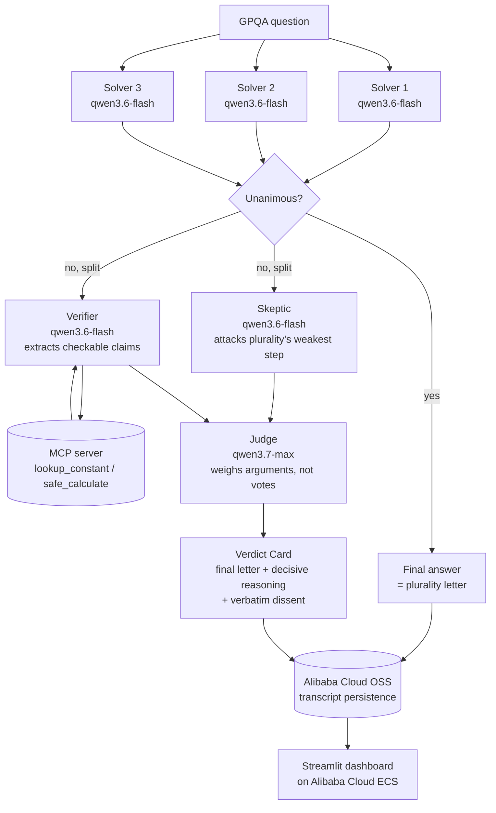

# Architecture

QuorumQA is a Qwen Cloud Agent Society: three cheap Solvers vote on every
question in parallel; a Skeptic, a tool-using Verifier, and a Judge are
escalated to **only when the Solvers disagree**. Unanimous questions never
pay for the expensive roles at all -- that asymmetric escalation is the
entire efficiency-gain story, not a benchmark trick layered on afterward.

## Cost cascade (why this beats a single-agent baseline)

| Role | Model | Thinking | Runs on |
|---|---|---|---|
| Solver seats 1-3 | `qwen3.6-flash` (cheapest) | off | every question |
| Skeptic | `qwen3.6-flash` (cheapest) | off | only on disagreement |
| Verifier | `qwen3.6-flash` (cheapest) | off | only on disagreement |
| Judge | `qwen3.7-max` (flagship) | **on** | only on disagreement |
| **Baseline** | `qwen3.7-max` (flagship) | on | every question, always |

Only **two** model tiers are actually billed in the frozen run: `qwen3.6-flash`
for all 270 solver, 34 skeptic and 53 verifier calls, and `qwen3.7-max` for the
34 judge calls and the 90 baseline calls. The judge is the same model as the
single-agent baseline, so the saving comes from *routing* that model to the
37.8% of questions that need it, not from avoiding it. An earlier design put a
`qwen3.7-plus` seat on the panel and in the skeptic role; it was dropped after
the 74-question run showed that seat was both the weakest solver and the source
of every JSON-malformation drop (see `SOLVER_MODELS` in `src/quorumqa/config.py`).

Two deliberate, measured design decisions here:

**Thinking mode is a budget, spent only at the adjudication layer.** Qwen3
hybrid models reason ("think") by default, billing reasoning tokens as
output. Our first live smoke run showed three *thinking* flash solvers
costing MORE than one thinking flagship call -- inverting the engine's
whole premise. So the fast-voter roles run with `enable_thinking: false`
(they exist to surface disagreement cheaply, not to deliberate), and the
one role whose output is a final ruling -- the Judge -- keeps full
reasoning. After this change, unanimous questions measured 2.5-6x cheaper
than the baseline call.

**The solver panel decorrelates through reasoning lens, not model family.**
The Heter-MAD finding from the deliberation literature (arXiv:2502.08788)
motivated an early attempt at mixing model families (flash/flash/plus) so
the three seats' failure modes would be less correlated -- but that plus
seat measured as the weakest solver and the source of every JSON-malformation
drop, and was dropped the same day (see the table above and `SOLVER_MODELS`
in `src/quorumqa/config.py`). Decorrelation now comes from three seats on
the same model, each answering through a distinct assigned reasoning lens
and its own temperature, instead of from mixing model families. A
unanimous-but-wrong panel is the one error this architecture cannot catch
(nothing triggers escalation), so decorrelating the seats is still what
protects the accuracy floor -- the mechanism just changed.

The benchmark (`benchmark/run_benchmark.py` + `benchmark/score.py`)
measures the actual blended cost-per-question and accuracy across a real
GPQA-Diamond sample -- see `benchmark/results/summary.md` after a run.

## Negotiation / conflict resolution

Disagreement isn't staged -- it's whatever the three independent Solvers
actually produce. When they split, the Skeptic must name the specific
inferential step it disputes (not a generic critique), the Verifier grounds
any numeric/factual claim through a real MCP tool call rather than letting
either side assert from memory, and the Judge rules by weighing arguments,
never by re-counting votes -- with any unresolved objection recorded
verbatim as dissent rather than papered over.

## Escalation-integrity metrics

Beyond raw accuracy, `benchmark/score.py` reports:
- **Escalation rate** -- % of questions that needed the expensive chain.
- **False-escalation rate** -- % of escalations where the Judge just
  re-confirmed the plurality (paid for nothing new).
- **Overturn-and-correct rate** -- of the times the Judge overruled the
  plurality, how often that overrule was actually right.

These three numbers together are what make "the escalation is earning its
cost" a checked claim rather than an assumption.
