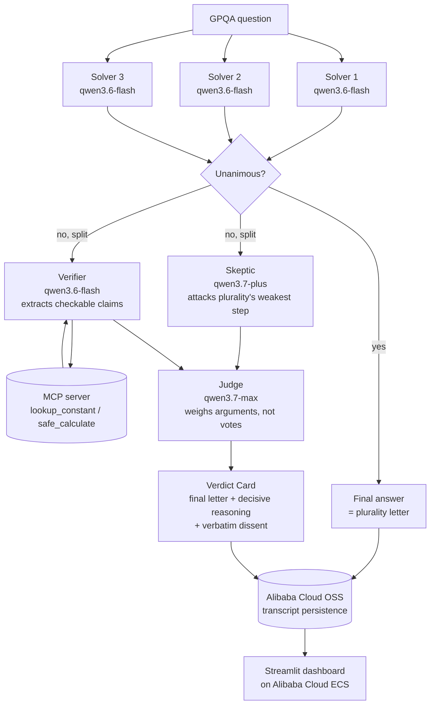

# Architecture

QuorumQA is a Qwen Cloud Agent Society: three cheap Solvers vote on every
question in parallel; a Skeptic, a tool-using Verifier, and a Judge are
escalated to **only when the Solvers disagree**. Unanimous questions never
pay for the expensive roles at all -- that asymmetric escalation is the
entire efficiency-gain story, not a benchmark trick layered on afterward.

## Cost cascade (why this beats a single-agent baseline)

| Role | Model | Runs on |
|---|---|---|
| Solver x3 | `qwen3.6-flash` (cheapest) | every question |
| Skeptic | `qwen3.7-plus` (mid) | only on disagreement |
| Verifier | `qwen3.6-flash` (cheapest) | only on disagreement |
| Judge | `qwen3.7-max` (flagship) | only on disagreement |
| **Baseline** | `qwen3.7-max` (flagship) | every question, always |

On a unanimous question, QuorumQA spends 3 cheap calls vs. the baseline's 1
expensive call. On a split question, it spends those 3 cheap calls *plus*
the escalation chain. The benchmark (`benchmark/run_benchmark.py` +
`benchmark/score.py`) measures the actual blended cost-per-question and
accuracy across a real GPQA-Diamond sample and reports both numbers
side-by-side -- see `benchmark/results/summary.md` after a run.

## Negotiation / conflict resolution

Disagreement isn't staged -- it's whatever the three independent Solvers
actually produce. When they split, the Skeptic must name the specific
inferential step it disputes (not a generic critique), the Verifier grounds
any numeric/factual claim through a real MCP tool call rather than letting
either side assert from memory, and the Judge rules by weighing arguments,
never by re-counting votes -- with any unresolved objection recorded
verbatim as dissent rather than papered over.

## Escalation-integrity metrics

Beyond raw accuracy, `benchmark/score.py` reports:
- **Escalation rate** -- % of questions that needed the expensive chain.
- **False-escalation rate** -- % of escalations where the Judge just
  re-confirmed the plurality (paid for nothing new).
- **Overturn-and-correct rate** -- of the times the Judge overruled the
  plurality, how often that overrule was actually right.

These three numbers together are what make "the escalation is earning its
cost" a checked claim rather than an assumption.
