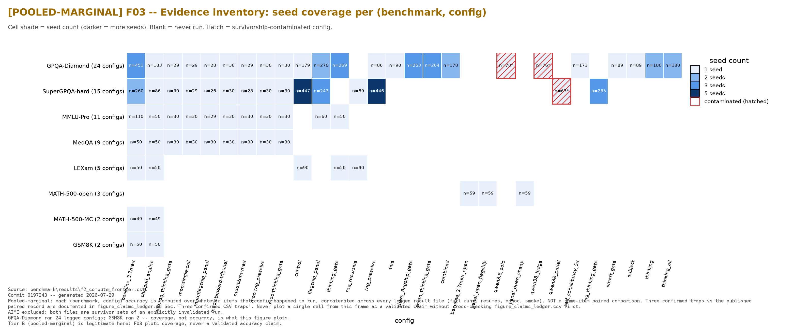
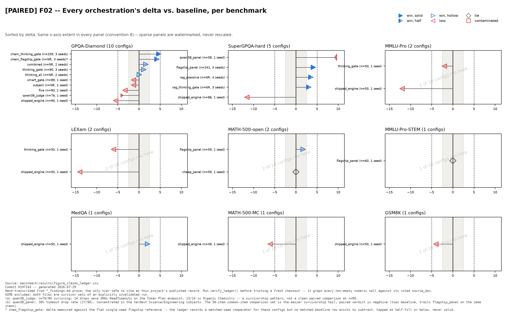
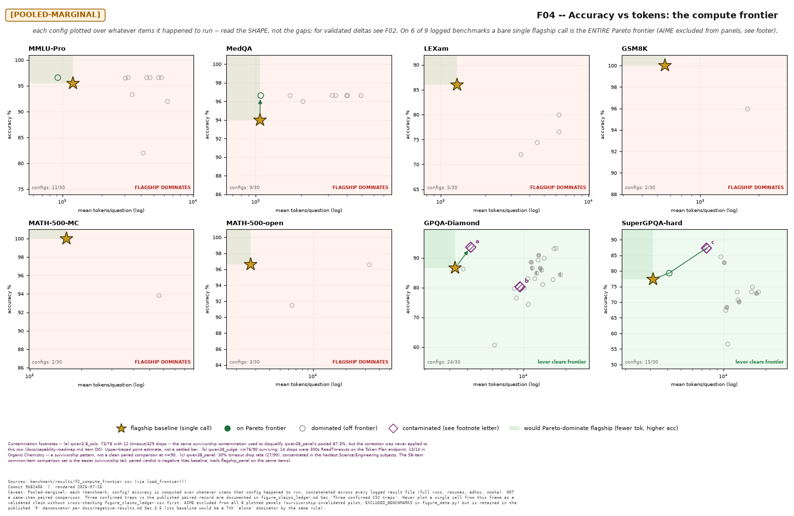
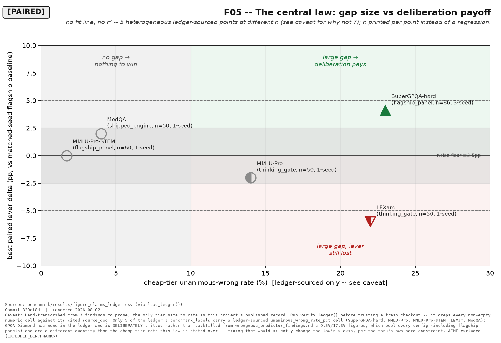
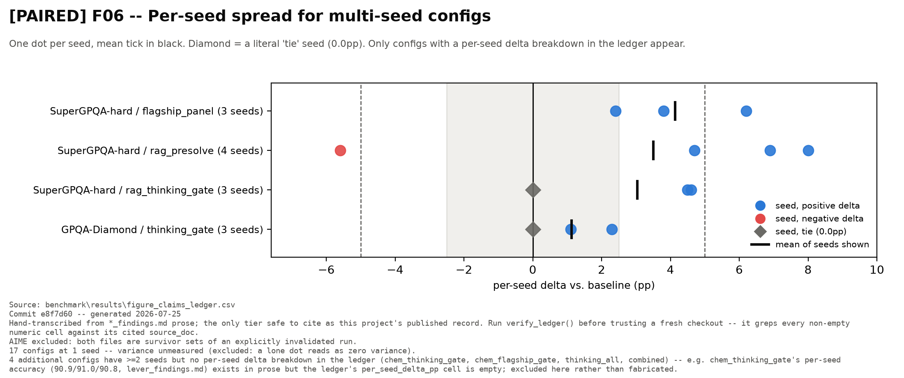
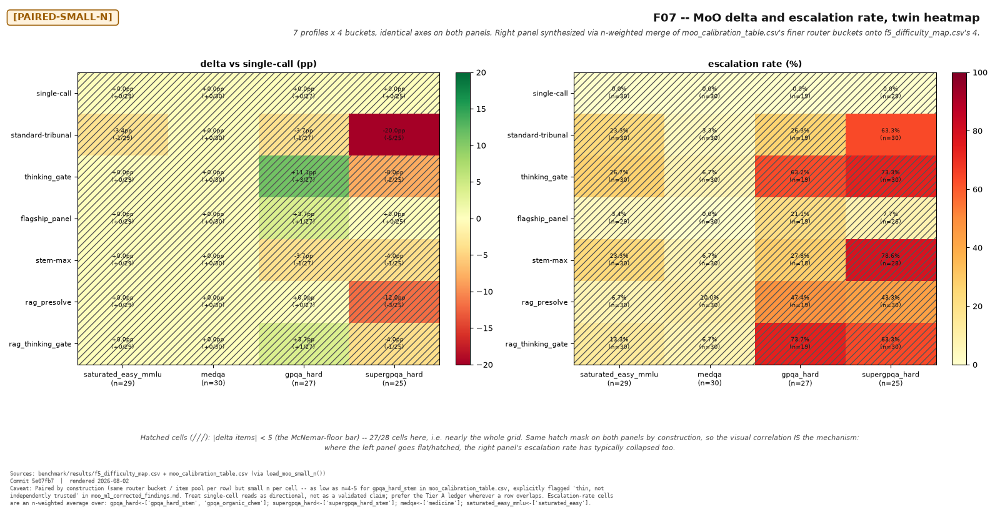
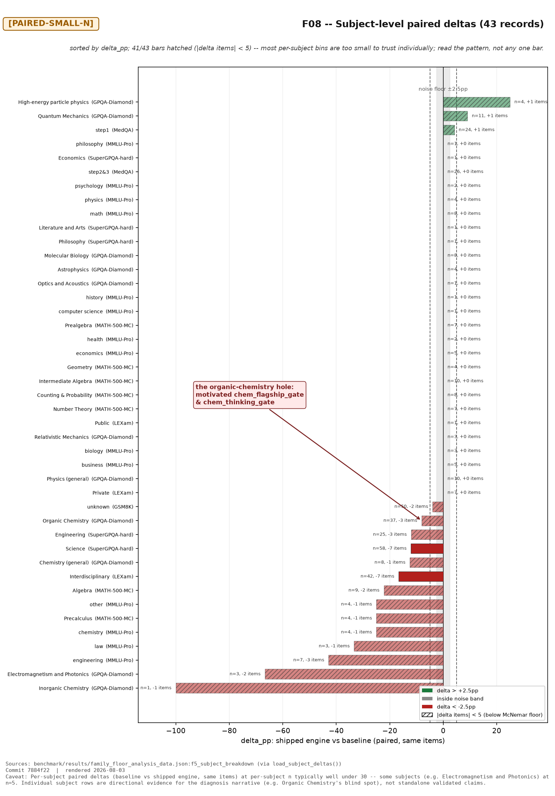
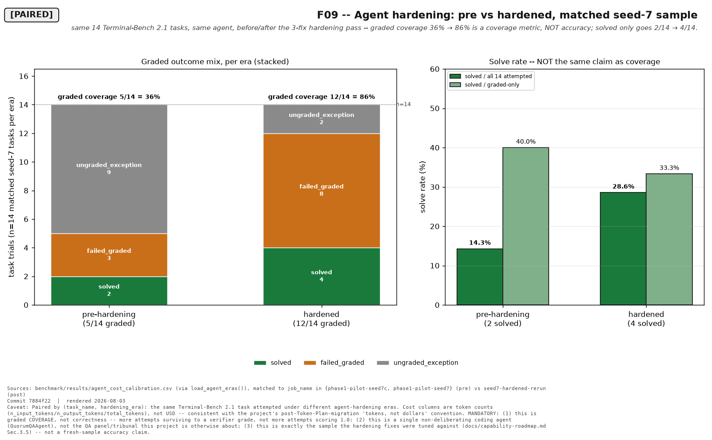

# QuorumQA — figures

Nine figures covering every orchestration we ran, on every benchmark, and how
each benchmark moved from the initial build to the current one.

Regenerate with (no API calls, no network — all inputs are committed):

```bash
python benchmark/make_figures_progress.py     # F01, F02, F03, F06
python benchmark/make_figures_analysis.py     # F04, F05, F07, F08, F09
python -m benchmark.figure_data --check       # verify the ledger against its sources
```

---

## 0. Read this before any figure

**Provenance tiers.** Every figure carries its tier in the *title*, not the
caption, so a cropped screenshot cannot lose it.

| Tier | What it is | Source | Legal use |
|---|---|---|---|
| **A — `[PAIRED]`** | Common-item, per-seed deltas: our published record | `figure_claims_ledger.csv` | Any delta or improvement claim |
| **B — `[POOLED-MARGINAL]`** | Each config over whatever items it happened to run | `f2_compute_frontier.csv` | Shape and coverage only — **never** a delta |
| **C — `[PAIRED-SMALL-n]`** | Genuinely paired but n=25–30, one seed | `f5_difficulty_map.csv`, `moo_calibration_table.csv` | Deltas only with item counts shown |

Tier B is not a lesser version of Tier A — it is a *different quantity*. Three
places it would have silently contradicted our own published numbers: it reads
MMLU-Pro `flagship_panel` at **+1.2** where our doc reports **+0.0** on the
identical 60 items; GPQA `shipped_engine` at **79.78%** (n=183, pooling smoke
runs) where we publish **78.9%** (n=90); SuperGPQA `flagship_panel` raw
**82.7%** against the validated **+4.1** paired mean. `benchmark/figure_data.py`
returns distinct Python types per tier with no shared base, so a pooled frame
**cannot** be passed to a delta figure.

**Excluded, deliberately and visibly.**
- **AIME** — every file is a survivor set of an explicitly invalidated run
  (32/60 panel + 12/60 baseline drops). Not plotted anywhere; its absence is
  printed in the footers rather than left silent.
- **Contaminated cells** are drawn hatched with a footnote letter, never solid:
  `qwen3.8_solo` (73/78, 12 drops), `qwen38_panel` (survivors of a ~30%-drop
  run; the paired verdict is negative), `qwen38_judge` (n=76, 13/14 drops in one
  subject).
- **USD is never plotted.** `cost_usd` logs as $0.00 for everything after the
  Token-Plan migration; the generator raises on any column matching
  `usd|cost|dollar`. Tokens only.

**Reading the marks.** Solid = paired, ≥3 seeds, clears the +5 net-discordant
bar. Half = 2 seeds, or net +3/+4. **Hollow = single seed, or inside the noise
band — nothing hollow is a win.** Grey ribbon = the ±2.5pp measured noise floor
(an n=90 control replicate flipped 14/90 items). Dashed lines = ±5, the minimum
net-discordant count clearing p<0.05 under exact McNemar.

---

## F03 — What data actually exists



Placed first on purpose. GPQA-Diamond has 24 configs; GSM8K has 2. Every thin
panel later in this document is thin because of this figure, not because
something was omitted.

## F01 — Build progress in gap space *(the core question)*


x = paired delta against a single `qwen3.7-max` call; **x=0 is flagship parity.**
Open circle = the initial build, filled triangle = current best, arrow between.

There is **no build *sequence*** here — one v1 (the shipped cheap panel) and a
*fan* of parallel lever variants. A genuine v1→current pair exists on only **4 of
9** benchmarks, so only those get arrows; the other five are labelled *"v1 only."*
Absolute accuracies do not travel across benchmarks (SuperGPQA-hard and
MMLU-Pro-STEM are 4-choice trims), which is why everything lives in delta space
and there is no accuracy leaderboard anywhere in this set.

What it shows: the gap to a single flagship call closed on all four benchmarks
where we built twice, and **crossed zero on two** — GPQA-Diamond (−5.5 → **+4.4**)
and SuperGPQA-hard (−11.6 → **+4.1**). LEXam (−14 → −6.0) and MMLU-Pro (−12 →
−2.0) improved substantially and still lose.

## F02 — Every orchestration, per benchmark, against the noise floor



The same delta space, one panel per benchmark, every config sorted. The shaded
band is why most of these are not claims: a lollipop inside it is
indistinguishable from a re-run of the same config.

## F04 — Accuracy vs tokens *(the uncomfortable finding)*



`[POOLED-MARGINAL]` — read the *shape*, not the gaps. **Six panels render on a
red "FLAGSHIP DOMINATES" ground; two on green.** On 6 of 9 benchmarks a bare
single flagship call Pareto-dominates every lever we built — more tokens for
equal or worse accuracy. Levers clear the frontier only on GPQA-Diamond and
SuperGPQA-hard.

## F05 — The central law, including where it breaks



The most useful figure here, because it **contradicts the simple version of our
own thesis.** SuperGPQA-hard (23% gap, +4.1) sits in *"large gap → deliberation
pays."* But LEXam (22% gap, **−6.0**) and MMLU-Pro (14% gap, **−2.0**) sit in
*"large gap, lever still lost."*

So the gap is **necessary, not sufficient.** It pays when the missing ingredient
is *decorrelation*; where the missing ingredient is *knowledge* — LEXam's Swiss
law against a STEM/US-law corpus — the gap is real, escalation fires, and the
answer is still wrong.

Five points, not seven: GPQA-Diamond is omitted because its only published
unanimous-wrong figure (9.5%) is a *pooled* quantity including flagship panels,
which is not the cheap-tier rate this law is stated over. No fit line, no r² —
five heterogeneous points at different n do not earn a regression.

## F06 — Per-seed spread



Replication quality, which a mean hides: `chem_thinking_gate` clusters inside
0.2pt across three seeds, while `rag_presolve` reads +4.7 / +6.9 / +8.0 and then
**−5.6**. Same mean-positive lever, entirely different confidence. Single-seed
configs are excluded (a lone dot reads as zero variance) and counted in the
footer.

## F07 — MoO routing: delta and escalation



`[PAIRED-SMALL-n]`. Two panels on identical axes; the correlation between them
*is* the mechanism — escalation collapses, delta collapses. **27 of 28 cells are
hatched as below the McNemar floor**, which is the honest headline: at n=27, one
item is 3.7pp, so every cell prints `+3.7pp (+1/27)` and almost none of it is a
real effect.

## F08 — Subject-level deltas *(the diagnosis)*



The organic-chemistry hole that motivated `chem_flagship_gate` and
`chem_thinking_gate`. Bars with `|delta_items| < 5` are hatched.

## F09 — Coding agent: initial vs hardened



Graded **coverage** 36% → 86% on the seed-7 Terminal-Bench sample, with solved
going 2/14 → 4/14 — shown as a separate bar so the headline cannot be misread as
accuracy. Three caveats in the footer: this is coverage, not correctness; it is a
single non-deliberating agent, not the QA panel; and it is the sample the
hardening was tuned against.

---

## Numbers behind the pictures

Every figure writes the exact frame it plotted to
`benchmark/results/figure_fNN_<name>.csv`. The claims ledger
(`benchmark/results/figure_claims_ledger.csv`, 36 rows) is hand-transcribed from
the findings docs and **self-verifying**: `verify_ledger()` greps every non-empty
numeric cell for its literal formatted value in the doc it cites — 99 numbers
currently verified. A transcription typo fails the check rather than reaching a
figure.
